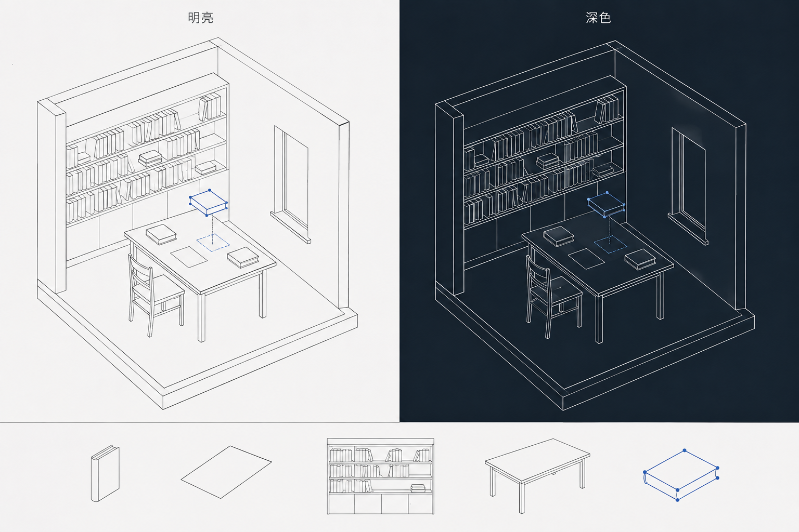

# PULSE 空间首页重构方案 · 给 KIMI 的设计与执行说明

> **2026-09-07 体验修订：请优先读 [09 粒子地表世界与交互 Demo](09-particle-world-experience.md)。** 用户已明确要求“贴近巨大星球俯瞰地表、拖动探索坐标、连续下降进入房屋”。本文的固定轴测书房首页、对应旧图和第 13 节交接中的旧体验顺序仅作历史参考；不要照旧实施。主题、双语、书本阅读、墙/门/家具自由编辑和小状态区仍保留。当前产品已到 `3f2b9d9`，下文基线和待实施陈述是旧快照。

版本：v1.0 执行方案，已纳入本轮偏好与自由设计范围。源码核对基线：`5a987f7`。本轮交付文档与概念图，没有修改产品 UI、安装外部 Skills 或发布网站。

## 1. 已确认的需求与待定选择

### 用户已明确

- 现有界面不好看，中英文混搭且有明显的模板感，希望重构。
- 进入首页就来到自己的“房子”；房子是个人表达空间，不一定是字面上的建筑。
- 选定 A：开放书房的空间关系，用点、线和少量平面表现纵深；尽量简洁、有设计感，不用写实木纹或繁复装饰。
- 自由设计包括房间本身：拖动墙角、调整尺寸，规划墙、门和家具，不仅是整理书本。
- 文章表现为书架或桌上的书本、纸张，点击后进入舒服的阅读页。
- 动效重点是整理收藏：拖动书本，吸附到书架或桌面位置。文章保存、翻书等更复杂表现以后增强。
- 明暗初始跟随系统；语言默认中文。明暗和中英文各有清楚的切换入口，记住用户选择。
- 首页保留很小的状态区，详细主机雷达、事件流和指标展开再看。
- 前端结构需要支持后续主题、语言、空间物件和文章扩展，避免到处打补丁。

### 不再重复询问的决定

空间形态已选 A，视觉气质已收敛为简洁点线，文章是书与纸，重点是拖动吸附；主题、语言、小状态区和房间编辑范围也已确认。初轮关于生活感/材质的提问已被“点线、简洁”这一新回答取代。

尚未逐像素确认的是线条粗细、强调色和编辑控件的具体位置。KIMI 先按下面的候选参数做一组明/暗原型，再让用户针对画面做小调整，不重新展开风格问卷。轴测示意不是建筑工程建模，不把用户的自由设计理解成 CAD 全功能。

## 2. 已选空间的点线明暗概念图



来源：本轮按用户选择重新生成的讨论用概念图。方向确定为开放书房的点线表达；图并非最终 UI，也不是已实现编辑器。

这张图用于确认三件事：线条能形成墙/地面/家具的前后关系；明暗使用同一构图；选中书本和落点用少量强调色表示。

**正式版必须进一步减法：** 图中书架书本和家具内部线条偏多，不能照描。默认只呈现少量真实文章物件，例如 3–6 本；没有文章时显示空书架和可操作入口。删除椅背装饰、密集书脊细线和不必要的台面厚度线。不能为凑密度虚构几十篇文章。

- **点：** 主要表示选中对象的抓手、可编辑墙角或合法落位，不是背景星空。
- **线：** 分结构轮廓、普通物件、辅助指引三档；遮挡处隐藏，避免透视线全部穿透成网状图。
- **面：** 仅为区分前后提供非常轻的平面差异或遮挡填充；不使用写实材质。
- **色：** 中性色主导，仅给选中、落点和必要状态少量颜色。图中蓝色是候选强调色，可以调整。

首轮 [A/B/C 空间比较图](design/pulse-space-directions.png) 保留为讨论历史；用户只采纳 A 的空间结构，没有采纳其木纹、植物、纹理和复杂光影。KIMI 不要倒退到这张旧图的材质风格。

## 3. 当前问题：首页的主角选错了

当前 HTML 是 230px 左栏、310px 右栏、中间画布、底部 130px 指标区组成的工作台。对于观察服务器，它有作用；对于进入自己的书房，外围信息占了主角的位置。

从本轮源码读到的具体问题：

- 首页有英文口号、全大写栏名、中文解释和英文事件动词混排。`feedEvent` 还固定使用 zh-CN 时间格式。
- CSS 主要是深色变量，但具体组件仍写了大量颜色；Canvas 的指针、脉冲、雷达也直接写十六进制颜色。
- 视图模式、连接回调、指标更新和 DOM ID 紧耦合。直接删侧栏，可能让 `onMessage` 或 `renderPorts` 访问不存在的元素。
- 主画布目前呈现实时点和雷达，没有可阅读、可整理的房间物件模型。
- 移动端主要通过隐藏右栏缩减布局；仍保留固定左栏，不适合把房间和阅读当核心的窄屏体验。
- 当前 Canvas 全局隐藏系统鼠标。新的点击、拖动、抓手和文本选择需要各自明确的光标反馈。

本轮依据源码核对；没有启动浏览器重新截图，也没有重新验证线上部署。A/B 与 Radar 已有新代码，不应按旧进度文档重新实现点击、心跳或雷达。

### 设计判断

首页让点线房间、书本和真实访客承担视觉记忆；外围界面只负责方向、设置和状态。文章阅读切换到清晰稳定的 DOM 排版，避免让长文跟着房间透视倾斜。

“减少 AI 感”落实为：去掉无任务意义的大口号、重复小标签、满屏发光和大块指标装饰；让线条层级、布局、字体与真实内容有关系。不能把深色荧光模板机械换成米白卡片模板就宣布完成。

## 4. 用四轮交付逐渐接近喜欢的界面

### 第一轮：已定方向，只校准线条和明暗

使用本页新的点线 A 图，不再比较庭院/抽象空间。做相同构图的明/暗原型，进一步简化书架密度，并放入最少界面：空间名称、文章、设计空间、明暗、语言和小状态区。

**交付：** 点线房间与双主题的视觉基准。**通过条件：** 用户认可画面密度和空间关系，能分辨哪些物件可点、哪些抓手只在编辑时出现。未完成细节反馈时，主题与语言基础可以独立推进。

### 第二轮：搭好外壳，马上改善现有页面

提取主题变量、语言字典和显示层；把原工作台的详细内容放进可展开的“运行状态”，保留小状态区。中文/英文、明亮/深色都可以实际切换。保留现有 WebSocket、presence、pulse、Radar 和预算保护。

**交付：** 能运行的双主题、双语言页面。**通过条件：** 刷新保持偏好，切换不重连、不丢状态，动态文字同步更新；原功能仍可通过运行状态入口找到。

### 第三轮：把首屏变成可以阅读的个人空间

用选定视觉方向实现一个固定空间、一个书架、一张桌子、少量书本/纸张。先采用明确标记的示例文章或用户提供的文章；物件对应稳定 articleId，点击打开 DOM 阅读页，返回回到同一个空间位置。

**交付：** 可以进家、找书、阅读、回家的闭环。**通过条件：** 不是一张静态大图上随意放透明点击区；书的位置、命中区域、标题与文章真实对应，窄屏也能直接从文章列表阅读。

### 第四轮：让空间和书本都能自己设计

这是一个编辑器功能包，分三个可运行的小交付推进：先墙角/墙段与门，再家具布局，最后书本整理和吸附。房间结构编辑属于用户本次目标，不能用“以后再做”从范围里删掉。

- 4a：进入“设计空间”后可拖墙角调整大小、增改直墙/隔断，在墙上放置与移动门；非法几何有预览和取消。
- 4b：移动与旋转桌子/书架，物件有空间位置和朝向；移动家具时其书本跟随，不散落成屏幕坐标。
- 4c：书从桌面或架位拿起，有落点预览，放下吸附；取消、撤销、保存与恢复都成立。

**交付：** 用户能把初始书房改成自己的布局，并整理文章。**通过条件：** 改墙/门不会破坏几何或丢失家具；拖拽不误开文章、不误发脉冲；刷新恢复且保存范围明确。复杂翻页、保存入架演出和多人同时编辑延后，不影响本轮的个人空间编辑目标。

每轮都让用户看到实际变化，最多一次集中修改后确认。不要一次性写完庞大世界再问“喜欢吗”。单轮验证发现功能错误必须修复；这里限制的是无依据反复换风格。

## 5. 首页与阅读页怎么组织

### 首页

- 大部分可用面积留给个人空间，初始相机对准书桌/书架，不播放长入场镜头。
- 页面上方只保留空间名称、文章入口，以及独立的明暗和语言控制。
- 一处小状态区显示连接状态与连接数，并能展开运行详情。没有真实作者认证前，不能把连接数写成实名人数。
- 原 Radar、端口、事件流和内存指标留在运行详情视图中，显示来源和 fixture/live 区别。关闭详情只停止无用绘制，数据边界与过期处理照常执行。
- 标题可在聚焦/悬停时显示，但不能只靠 hover；键盘选中或移动端点选也能知道是哪篇文章。保留普通文章列表，免得找一篇文章必须在房间里四处点。

### 阅读页

- 中文正文初始建议 18px 左右、1.75–1.9 行高、约 34–40 个汉字的阅读宽度；英文约 60–75 字符。它们是待实测的排版起点，不是强制审美。
- 标题、日期、正文和代码块有稳定层级；长链接和代码块局部溢出处理，不撑破整个页面。
- 使用可选择、可复制、可搜索的 HTML 文本。主题切换时正文也适配；中英文开关不自动翻译文章。
- 通过稳定链接进入文章，支持浏览器后退。关闭阅读恢复此前相机和被打开的书，键盘焦点回到触发物件或文章列表项。
- 房间是阅读入口；阅读时不要持续晃动、旋转页面或让远端指针遮住文字。

## 6. 明暗主题：一套语义，两种光环境

主题偏好为 `system | light | dark`；实际生效主题为 `light | dark`。首次无偏好时跟随系统，手动选择覆盖系统；用户可以从主题菜单恢复“跟随系统”。不按当地钟点擅自切换。

建议将颜色分成两组共用语义，而不是为每个组件增加 `.dark` 分支：

- 界面：`surface-page`、`surface-panel`、`text-primary`、`text-secondary`、`border-subtle`、`focus-ring`、`status-connected`、`status-error`。
- 空间：`room-plane`、`line-structure`、`line-object`、`line-guide`、`point-handle`、`book-selected`、`drop-target`、`cursor-local`、`cursor-remote`。

候选线宽以最终屏幕 CSS px 表示：结构 1.5、物件 1、辅助 0.75，选中 2；缩放时避免变成粗黑网格或细到消失。编辑点的可见圆点可以很小，命中区域单独扩大，触屏优先约 44px。控制柄只在编辑/选中状态显示。

初始候选色：明亮背景 #F6F8FA、主线 #303C49、正文 #202A34；深色背景 #151E27、主线 #B6C4D2、正文 #E8EEF3；强调色分别 #4267B2 / #8AABEE。辅助线不是正文颜色。具体对比度、强弱和显示效果由四组合页面实测，不把这些候选值当成已经验收。

CSS、SVG 和 Canvas 从同一套主题值取色。可用 CSS 自定义属性作为源，在主题变化时一次性读取并缓存 Canvas palette；不能每个动画帧都 getComputedStyle。SVG 用主题变量绘制线与面；夜间改变线条/背景的对比关系，不能反相整张图片或把文字跟着房间一起调低亮度。

偏好读取要在首屏绘制前执行，失败时有安全默认，避免先闪白再变暗。localStorage 读取/写入都捕获异常；存储失败仍能在本页使用。监听系统主题变化时仅在偏好为 system 时生效；如果同步多标签页偏好，不触发循环写入或重建 socket。

同时设置正确的 `color-scheme`，让原生控件/滚动条与页面一致。相关浏览器机制见 [MDN color-scheme](https://developer.mozilla.org/en-US/docs/Web/CSS/Reference/Properties/color-scheme) 与 [prefers-color-scheme](https://developer.mozilla.org/en-US/docs/Web/CSS/Reference/At-rules/@media/prefers-color-scheme)。

## 7. 中英文：统一显示语言，保留内容原文

语言状态独立于主题，第一版支持 `zh-CN | en`，默认中文。语言菜单用“中文”和“English”作为语言自称；PULSE 品牌、作者名、技术标识、原文文章不强行翻译。除此之外，同一模式下界面保持一致。

字典覆盖：导航、主题菜单、提示、空状态、错误、按钮的 aria-label/title、连接状态、运行指标、事件描述、Canvas 标签、阅读返回入口和拖拽结果。协议 type、eventId、Session ID 仍保持原值，翻译只发生在显示层。

当前 feedEvent 接受已拼好的文字。重构后先保留有界的结构化事件记录，再按 `locale` 格式化；切换语言时现有可见记录一起重绘，不能只有后来的消息变语言。日期和数值格式使用当前 locale，参见 [MDN Intl.DateTimeFormat](https://developer.mozilla.org/en-US/docs/Web/JavaScript/Reference/Global_Objects/Intl/DateTimeFormat)。

两份字典的 key 集合要有一致性检查；缺 key 在开发中可定位，正式界面使用默认中文或可读回退文案，不展示原始 key。切换后同步 document.documentElement.lang、页面标题及必要的辅助描述；文章内容语言可以单独标记。不要通过复制两份 HTML 或在网络回调里堆三元表达式完成国际化。

## 8. 2D 的纵深来自哪些关系

第一版推荐固定角度的轴测/斜俯视投影，不必为纵深立即引入完整 3D 引擎。纵深主要由墙角、地板外轮廓、物件侧边和遮挡形成；少量平面差异作为补充，阴影不是必需。避免把所有隐藏边也画出来。

物件至少区分地面层、家具层、书本层、交互提示层。对象拥有稳定世界位置/放置槽位，渲染时才投影到屏幕；相机位置、缩放和用户偏好独立保存。命中测试使用相同投影规则，并按可见遮挡关系选择最前面的合法对象。

书架槽位和桌面是不同放置表面：不能只用一个地面 screenToWorld 公式就把书准确吸附到高处书架。每个合法目标明确自己的 anchor、容量/兼容物件和命中区域；第一版使用有限槽位比无限任意摆放更容易做好。

拖动时的强调线、控制点和轻微抬升表达“已拿起”，不要用整屏视差或持续漂浮代替结构。减少动态效果模式关闭相机飞行和抬升，保留清楚的选中和落点提示。

当前 cursor/pulse 使用屏幕归一化坐标。若房间支持每人独立平移/缩放，多人指针必须同步升级为空间坐标契约并修改双方校验；不能直接把不同相机的 0..1 坐标当成同一个书本位置。若这一轮只做固定视图，明确记录限制，不宣称已经完成可漫游的多人世界。

## 9. 空间设计与整理的交互契约

### 设计房间本身

一个“设计空间”入口切换编辑状态；工具栏仅出现墙、门、家具、整理、撤销/重做、完成几个当前有用的操作。普通浏览模式隐藏尺寸、控制柄和辅助线，首页不常驻 CAD 工具面板。

建议第一版以可闭合的直线房间轮廓和直线隔断为边界；默认直角/网格吸附，家具旋转先按 90° 步进。任意曲墙、多层楼、布尔建模不进入首版。矩形模板只是起点，不能仅提供三个固定模板冒充自由设计。

- 拖动外墙角点或整段墙，预览房间形状和尺寸；可增加拐角、创建/调整隔断。不合法的交叉、自相交、零长墙、未闭合外轮廓不能提交。
- 房门依附 wallId 和墙上的位置/开口宽度，不是浮在屏幕上的图标。改墙时重新计算门位置；门超出墙段、重叠或墙太短时显示原因并允许调整/取消，不能静默删除门。
- 家具保存自己的局部尺寸、位置和朝向；书本附着 furnitureId/slotId。移书架时架上的书跟着走；删家具前把其书本转入可恢复的未放置列表，不删除文章。
- 缩小房间时预览哪些家具越界；先约束提交或让用户移动，不无提示瞬移物件。墙和家具改动按一次手势提交一条 undo 命令，不为每个 pointermove 建历史。
- 默认编辑的是当前作者自己的本地草稿。完成时保存整份场景数据与 schemaVersion；加载校验失败回退可恢复草稿，不把损坏 JSON 直接绘制。来源、尺寸、数量与撤销历史都有明确上限。
- 初始工程预算建议最多 64 个外轮廓顶点、64 段隔断、32 个门、100 件家具、200 个文章物件和 50 条撤销记录；这是可调整的资源边界，不是性能保证，超出时给明确提示。

**最小验收故事：** 把默认房间拉宽 → 加一段隔断 → 把门移到另一段墙 → 旋转并搬动书架 → 将书拖入新架位 → 撤销一次 → 刷新恢复。只有整理书本能拖动，不能算空间编辑器完成。

### 整理书本

先区分普通阅读模式与整理模式。普通点击书本打开文章；整理模式里点击选中，拖动改变位置。保留非拖拽操作“移动到书架/桌面”，让键盘和触屏也能整理。

状态顺序：`idle → pressed → dragging → settling → idle`；取消可从中间状态回到原合法位置。

1. 按下立即反馈，移动超过小阈值才判定拖拽。阈值作为可调参数，例如 6–8 CSS px，按触屏实测调整。
2. Pointer Capture 保持指针离开物件后的连续跟踪；保留抓取点偏移，物件不能突然跳到指针中心。拖动过程不套慢速缓动。
3. 有效目标显示落点预览；无效、满位或不允许的表面有清楚反馈。拖动过程中不不断写存储或广播文章更新。
4. 放手后才计算最终合法位置，执行短吸附动效。动效可中断并从当前画面位置继续；不要通过禁用整个页面等待动画结束。
5. 无效放置、Escape、pointercancel 或失焦取消时回到原合法位置并清除拖动状态。支持一次撤销；取消不能变成点击打开文章。
6. 物件拖动、空白相机拖动、阅读点击和打招呼脉冲共用明确的手势分派。拖书结束不触发 Canvas click 的脉冲；UI 按钮也不向世界透传点击。

首次建议吸附落位在约 180–260ms 的体感范围内收敛，但不要为了固定时长破坏跟手与中断。重视觉资源加载不能阻塞本地指针。

### 位置保存与文章保存分开

文章内容由 articleId 指向；布局保存 articleId/objectId 与目标 slotId 或世界位置。移动书本不修改文章标题/正文、不更改永久链接、不触发 GitHub 写回。

当前没有持久作者鉴权：本地原型整理仅改变当前浏览器的布局，明确提示“此设备保存”；不能暗示别人会同步看见。以后接入远端布局持久化，要增加房屋所有权和版本冲突契约，普通访客不能改作者的布局。

一旦接入异步保存，区分布局预览、保存中、已保存、保存失败；不能用“落位动画结束”代替服务端保存成功。失败保留可恢复的本地改动和重试入口。

## 10. 前端结构：按已出现的职责拆分

保留 Go 和原生 ES module。点线房间建议用可交互 SVG，沿用 Canvas 承担实时指针/脉冲/Radar，阅读与设置用 DOM。明暗和双语本身不要求 React、Next.js 或新打包系统。只有实际需求说明收益时再讨论技术栈变更。

下面是建议职责与创建顺序，不是要求先建一堆空文件：

```text
static/
  index.html              语义化入口，首屏偏好初始化
  app.js                  装配入口；逐步移出显示细节
  style.css               页面/组件样式
  tokens.css              第二轮：明暗语义变量、字体、层级、动效参数
  preferences.js          第二轮：主题/语言偏好、持久化、订阅与清理
  i18n.js                 第二轮：字典、t、动态文案与格式化
  status-view.js          第二轮：紧凑状态区和展开详情，消费状态
  pure.js                 保留已有计算和有界缓冲行为
  scene.js                第三轮：共享投影、SVG 场景与命中测试
  room-model.js           第三轮起：墙角/墙/门/家具/文章物件的稳定模型
  reader.js               第三轮：DOM 阅读、链接和返回焦点
  editor.js               第四轮：编辑工具、手势状态和指令调度
  layout.js               第四轮：几何/槽位规则、撤销与场景存储边界
```

网络状态与订阅继续复用已有实现，必要时另提取连接模块；普通主题/语言/详情切换不能重新 connect、重复创建 rAF 或 interval。所有模块明确初始化、订阅与销毁责任。scene 对外接收 palette、偏好与数据，不直接读取存储；布局计算尽量接收显式参数便于测试。

现有 DOM ID 迁移要和消费者一起修改。先让网络更新数据，显示层消费数据，再移走旧面板。不要用一串可选链掩盖遗漏的必需 UI，也不要让后台事件因面板关闭抛异常。

点线家具由少量 SVG 几何与可复用的物件模型生成，不把生成的 PNG 用作可编辑房间。SVG 可采用 non-scaling-stroke 保持屏幕线宽，参考 [MDN vector-effect](https://developer.mozilla.org/en-US/docs/Web/SVG/Reference/Attribute/vector-effect)。命中层与可见细线分开，不要求用户精确戳中 1px 线。

SVG 和 Canvas 共享同一个相机、投影与 CSS 尺寸；Canvas 单独处理 DPR，不能让指针层和房间缩放两次。Canvas 叠层默认不截获 SVG 控制柄；交互由共同容器按对象、模式和手势分派。事件冒泡和 pointer capture 的归属写清，不能引入两套互相抢指针的拖拽系统。相关机制见 [MDN setPointerCapture](https://developer.mozilla.org/en-US/docs/Web/API/Element/setPointerCapture)。

场景模型必须保存用户可编辑的墙/门关系和物件 ID，而非一串最终 SVG path。当墙角变化，由模型重新生成投影；序列化模型后可重建同样的房间，换主题不改场景数据。

## 11. KIMI 每轮的验收清单

- 明亮/深色 × 中文/英文四种组合都查看桌面和窄屏；页面、菜单、Canvas、阅读区和运行详情统一适配。
- 键盘能切换设置、找到文章、关闭阅读、打开运行详情；焦点可见，Escape 后回到合理位置。
- 空间无文章、连接断开、sensor 离线、fixture 注入、存储失败都有对应状态，不用随机数或虚假热闹填充。
- 切主题/语言、反复开关详情后，WS 连接数、监听器、发送 interval、rAF 不意外增加。
- 保留 presence/cursor/pulse、输入保护、重连、慢消费者和 Radar 来源语义。真实两客户端链路回归，不能只检查页面截图。
- 第三轮验证书与文章对应、深链接和返回；第四轮覆盖外墙角调整、隔断、依墙门洞、家具跟随关系、自相交拒绝、拖拽取消、无效落点、抓取偏移、撤销/重做、刷新恢复及不误发脉冲。
- 偏好逻辑、字典 key、坐标/槽位和布局保存用确定输入测试；浏览器覆盖真实事件与消费端。旧测试继续运行，新增测试针对行为，不镜像实现。
- 图片未加载时仍能打开文章列表。中文和英文变长不会遮住操作入口；长文能正常滚动与选择。
- 明确记录语法、单元、集成、浏览器及生产验证层级。Go 内嵌静态资源，修改前端后重新启动/构建再验页面，避免看旧资源。

## 12. Skills 调研与使用顺序

以下是本轮通过在线原仓库和 Skills 目录核对的参考，不是“多装几个就自动变好看”。一次确定一个设计负责人式的主 Skill，其他用于专项检查；本轮没有安装或更新任何外部包。

### 主设计：Anthropic frontend-design

适合本次把首屏的主体、排版、材料与文案重新建立起来。它明确强调围绕具体产品做视觉决定，而非复用通用模板。[原始 Skill](https://github.com/anthropics/skills/blob/main/skills/frontend-design/SKILL.md) · [目录与安装信息](https://www.skills.sh/anthropics/skills/frontend-design)。

目录本次查询显示约 862.2K 安装、源仓库约 174.8K stars；热度只作筛选信号，推荐依据是内容与本任务匹配。可选安装命令：`npx skills add https://github.com/anthropics/skills --skill frontend-design`。KIMI 不支持同一命令入口时直接阅读文件，不能假设斜杠命令通用。

### 设计过程参考：Impeccable

适合收敛设计、审视信息主次与检查主题/响应式完成度。[项目说明](https://github.com/pbakaus/impeccable) · [当前 Skill](https://github.com/pbakaus/impeccable/blob/main/.agents/skills/impeccable/SKILL.md)。可选流程是先 shape 明确方案，再 critique 评估，最后 audit/polish；实际调用以安装版本说明为准。

注意：同仓库旧 `frontend-design` 名称已被标记弃用并更名为 `impeccable`；不要照着旧教程安装后当成仍是同一入口。[旧名称说明](https://www.skills.sh/pbakaus/impeccable/frontend-design)。本轮目录旧入口约 54.5K 安装、仓库约 66K stars，这不等于新命令的安装量。官方当前安装入口见项目 README，不在本稿自动执行。

### 交付检查：Vercel web-design-guidelines

适合检查键盘、焦点、控件语义、响应式和主题支持，不负责替用户选择房间风格。[Skill](https://github.com/vercel-labs/agent-skills/blob/main/skills/web-design-guidelines/SKILL.md) · [具体规则](https://github.com/vercel-labs/web-interface-guidelines/blob/main/command.md) · [目录](https://www.skills.sh/vercel-labs/agent-skills/web-design-guidelines)。

本轮目录约 613.4K 安装、仓库约 30.9K stars。可选安装命令：`npx skills add https://github.com/vercel-labs/agent-skills --skill web-design-guidelines`。它会引用远程规则，执行前读内容并记录版本/日期，不让来源更新覆盖用户已经确认的需求。

### 已有本地经验与筛选结论

- 本轮采用 apple-design 的直接操控、抓取偏移、可中断动效和空间返回原则；不意味着要做满屏玻璃或照搬 Apple 产品外观。
- 项目 comment-convention 继续约束新函数和业务回调；关键是写清坐标单位、状态副作用、计时器与监听器归属。
- design-taste-frontend 明确把实时协作 UI 排除在主要适用范围之外，因此只参考其反模板审视，不把营销页规则强套到房间交互。
- 暂不为明暗/双语引入重型 React 专项 Skill；先根据现有原生 JS 的实际职责完成架构。

## 13. 可以直接复制给 KIMI

```text
请先阅读 docs/08-ui-redesign-brief-for-kimi.md 与其中的概念图，
再核对 AGENTS.md、当前 git status、static/index.html/style.css/app.js/pure.js。
现有源码已推进到工作台 UI、pulse、可靠连接与 Radar，别按旧 L1/A 进度重写。

目标：进入一个有纵深的 2D 个人空间，文章是书架/桌上的书与纸，
点击进入舒适的 DOM 阅读页。首页只留小状态区，运行详情可展开。
默认跟随系统明暗、默认中文；两个独立切换入口，偏好持久化。
主题必须覆盖 DOM 与 Canvas，翻译必须覆盖已有动态事件与画布文字。
整理动效优先做拖动、落点预览、吸附与取消；复杂保存/翻书表现以后增强。

已确定 A 开放书房，用点线表现，尽量简洁；不采用首轮写实材质。
自由设计包含拖墙角、改尺寸、规划墙/门/家具；不能只做书本整理。
按新明暗图校准线条，进一步减少书架密度；不把 PNG 铺成整页假 UI。
按四轮交付：点线视觉 → 主题/语言外壳 → 书房与阅读 → 空间编辑与整理。
第四轮内部依次交付墙/门、家具、书本吸附，每步都能运行。
每轮可运行、能看见变化；给明确验收和需要用户评价的一个视觉点。

保留 Go + ES module，建议 SVG 绘制点线房间、Canvas 保留实时层、DOM 阅读。
共享模型和投影；墙/门/家具是可序列化数据，不是静态图。按职责拆分，不先迁框架。
保留已有真实多人、脉冲、连接保护和 Radar 来源语义。
拖书与相机拖动、打开文章、点击脉冲要区分；切主题/语言不能重建连接。
布局保存与文章内容保存分开；本地原型不得暗示跨设备持久化。
每个函数与业务回调写中文契约注释，保护已有代码与未提交工作。
不要一次重写所有页面后才问我喜欢不喜欢；不自动推送或部署。
```

## 14. 本轮交付与验证边界

交付本 Markdown、一张点线书房的明暗与元素对照图，并保留首轮空间比较图为讨论历史。用户已确认点线 A、可设计墙/门/家具、书本阅读与吸附、主题/语言和小状态区；细线密度与编辑控件需用实际原型校准。程序 UI、主题切换、国际化和编辑拖拽都仍是待实施任务。

本轮核对当前源码和在线 Skill 内容，没有运行产品测试或浏览器交互。两份修改/新增 Markdown 的围栏、尾部空白与 14 个本地链接/图片路径检查通过，git diff --check 通过。在线目录热度是查询快照，会变化，不作为兼容性或质量保证。
