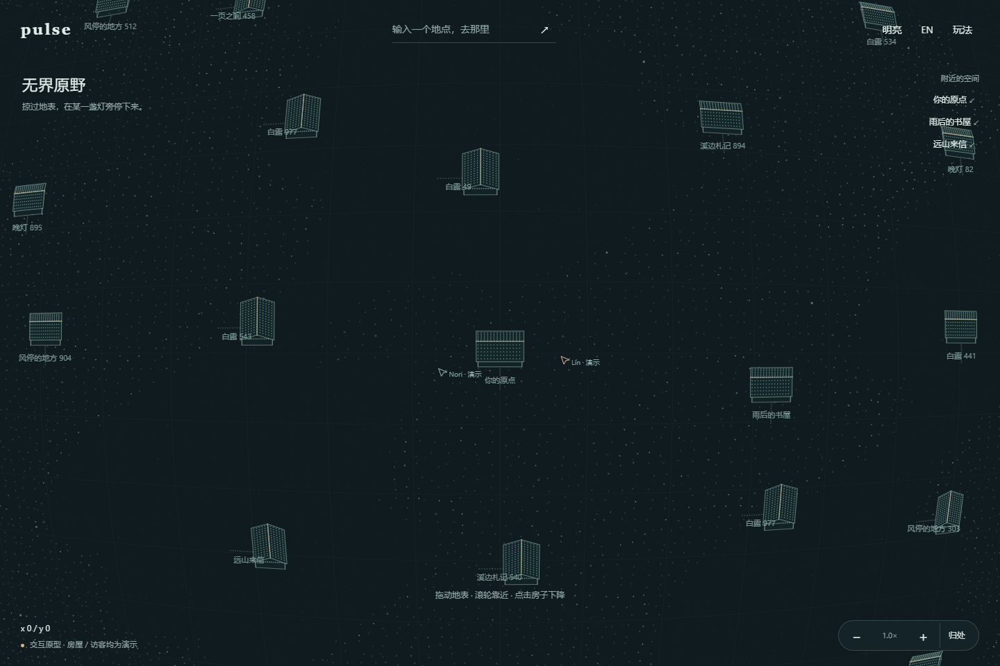
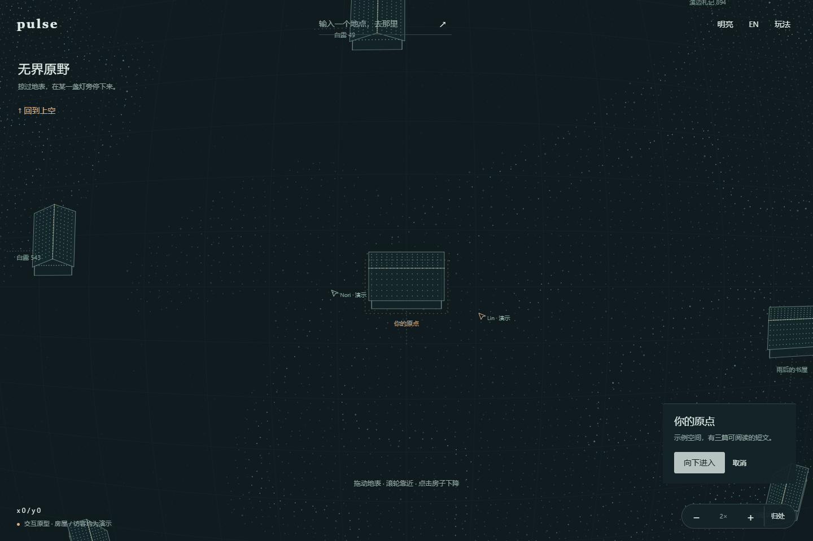
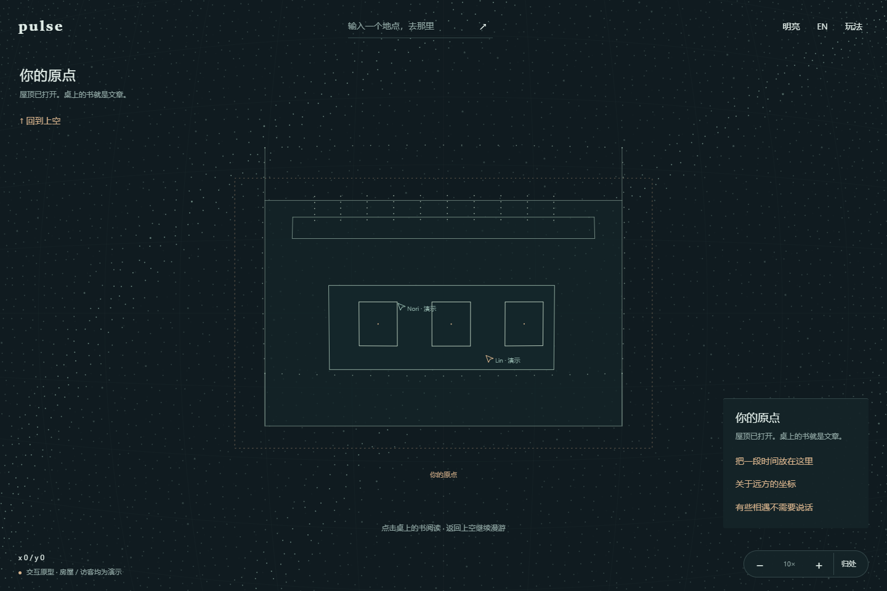
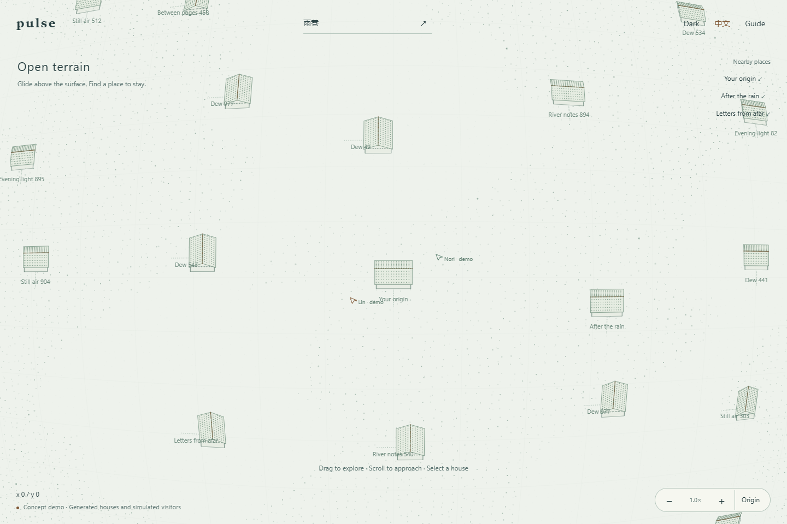

# PULSE 粒子地表世界 · 给 KIMI 的体验修订与 Demo

更新：2026-09-07。产品源码核对基线：`3f2b9d9`。本次交付独立 HTML、实际运行截图和交接文档；没有修改 `static/` 或 Go 服务，没有提交、推送或部署。

**当前空间体验以本文为准。** [08 旧方案](08-ui-redesign-brief-for-kimi.md) 中“固定开放书房作为首页”“轴测房间作为整体构图”已被用户纠正。主题、双语、阅读、自由搭建、小状态区等需求继续保留。

## 1. 先理解这次到底改什么

用户要的是：**贴近一颗巨大星球俯瞰地表，视野里看不到星球轮廓；拖动探索坐标，经过别人的房子，选中一间后连续下降，屋顶渐隐，最后看到书和文章。**

用户两项最新确认，原意如下：

> 像贴近一颗巨大星球俯瞰地表：有弧度，但看不到完整球体边缘；拖动探索新区域。

> 从高处连续下降：房子越来越大，屋顶淡去，最后看见内部的书和文章。

旧文档的问题在于把“房子”写成了首页画面的全部。KIMI 当前实现的静态 SVG 轴测书房符合那个局部描述，却缺少最关键的世界和镜头关系。此次修订由体验顺序重新定义实现，不再只用“简洁、有设计感、有纵深”指导开发。

“进入我的房子”的长期意图仍成立：初始坐标可以位于自己房子的上空，个人空间是归处；新用户首先应能感知它坐落在一个可以探索的世界里。

## 2. 先运行这个 Demo，再动产品代码

打开 [粒子地表交互 Demo](../outputs/pulse-particle-world-demo.html)。单文件，无构建步骤、无外部字体、无 CDN，也不连接 `/ws`。可以直接用浏览器打开 HTML。

需要 HTTP 预览时，在项目根目录用 PowerShell 7 执行：

```powershell
node work/serve-particle-demo.mjs
```

终端会输出本机预览地址，端口每次可能不同。只服务这份 HTML，不暴露仓库目录。

按这个顺序试两分钟：

1. 拖动地表：坐标变化，房子和地表一起经过视野；抓住的位置跟着指针走。
2. 把鼠标放在一间房子附近滚轮缩放：地点留在鼠标下，远近发生变化。
3. 选“附近的空间”中的“雨后的书屋”，再点“向下进入”：观看同一房子变大、屋顶淡去和桌上书本显露。
4. 点击桌上的书或文字入口：进入可选择文字、可滚动的阅读页。关闭文章，再“回到上空”，继续探索。
5. 输入一串地点文字再前往，重复输入会回到相同示例坐标。随后试明暗、语言和窄屏。

这份 Demo 用来对齐**运动与空间关系**。它是可继续调整的第一版，不代表用户已经确认粒子密度、弧度、房屋造型和颜色。

### 实际运行画面









图片来自本次浏览器运行截图，不是生成的概念图；**静态截图无法证明连续下降，请实际操作 HTML**。窄屏另见 [漫游](design/particle-world-mobile.png) 和 [室内](design/particle-world-mobile-interior.png)。

## 3. 必须复现的画面与手感

### 地表是主角

画面由粒子组成地表疏密、少量弯曲辅助线和点线房屋组成。中心附近比较舒展，四周有曲面压缩，拖动时地表整体流过视野。弧度要能被感受到，但不能把全景做成鱼眼圆盘。

世界持续铺满视口。缩远时从房屋变为聚落点，仍然处于地表上空；不能缩成一颗漂在黑色背景里的完整小球。拖远不能遇到一块方形底板边缘或突然空白。

粒子属于地表和建筑：同一坐标的地貌稳定，屋顶粒子跟随屋顶。它们不是固定在屏幕上的随机星空，也不是鼠标经过才出现的粒子特效。允许很轻的明暗呼吸，避免全屏闪烁、强光晕和长拖尾抢走文字与房屋的注意力。

### 相机的三个动作

- **拖动：** 直接操控抓住的地表点。松手有短暂衰减的惯性；重新按下立即接管，不能先等动画结束。
- **缩放：** 围绕指针或双指中点改变距离。房子的位置、身份和方向保持稳定；不能只放大 CSS 画布。
- **下降：** 从当前镜头同时靠近房屋中心和放大。屋顶随接近程度渐隐，室内在原位置显露；原房屋从未被卸载再替换成另一张房间图。

初版下降约 1.7 秒，返回约 1.35 秒。它们是 Demo 的调参起点，不是硬性审美标准。系统减少动态效果时直接到达目标，停止惯性和持续呼吸，保留完整操作能力。

### 控件退到边缘

顶部只放品牌、地点入口、明暗、语言和必要帮助。底部保留坐标与缩放；正式版的小连接状态可在这里，详细 Radar/指标进入抽屉。HUD 是屏幕坐标，房屋、文章物件、访客位置属于世界或房屋坐标。

页面不要再围绕中央 SERVER 或端口数字组织构图。保留真实诊断能力，但把日常的“探索与阅读”作为首页任务。

## 4. 连续下降的具体编排

按一个连续的相机过程处理四个可理解的阶段：

1. **探索：** 地表上有多间房子；选中后显示名称与进入动作。
2. **靠近：** 从当前相机开始向目标平移，缩放按对数尺度插值；用户仍能中断。
3. **穿过屋顶：** 只让目标房屋的屋顶和屋顶粒子渐隐；墙、地面、桌子始终使用同一房屋坐标。其他房子保持屋顶。
4. **停留：** 书变成可选对象；阅读使用 DOM。返回时逆向恢复空间关系和屋顶，不突然切换首页。

透明度由**当前接近程度**计算，不能由独立 `setTimeout` 分别控制。否则打断动画、调整窗口或减少动态效果时，容易出现屋顶已消失但镜头还远、室内已经可点但不可见的错误。

正式状态模型可以显式区分 `explore → approaching → inside → reading`；相机拥有连续数值，状态只约束可用动作。取消下降、重新选择房子、回到上空都必须有出口。不要创建多条同时修改相机的动画队列。

## 5. “无限感”的工程定义

用户描述的是**没有可见终点的探索感**。有限球体绕一圈回到原点，与不回绕的巨大世界是不同模型；本次选后者的数据语义，借局部曲面表达前者的视觉感觉。

Demo 采用：连续平面世界坐标 + 局部曲面投影 + 视野内确定性生成。没有真实有限球体、球面经纬度或全球地理模型。

以 `u=(worldX-cameraX)*zoom`、`v=(worldY-cameraY)*zoom` 为局部坐标：

```text
q = sqrt(1 + (u² + v²) / R²)
screenX = width * 0.5 + u / q
screenY = height * 0.53 + v / q * 0.82 - objectHeight * zoom * 0.62
R = hypot(width, height) * 0.78
```

这是原型的视觉近似，不是完整三维光学投影。曲面投影的边界落在视口以外，地面位置可逆投影，因此可以做稳定的拖动和光标锚定缩放。房屋的高度投影经过简化，倾斜、高度遮挡仍可优化。

这份 HTML 的缩放内部值有 `0.025–14` 的保护区间；越过边界不会露出完整球体，仍能平移。它没有“无限放大后还能不断出现新内容”的递归细节，也不承诺 JavaScript 数字可以无限增长。不要向用户声称实现了物理意义上的无限世界。

正式版需要：

- 坐标按区块加载，缓存有淘汰上限；近处读房屋，远处读聚合摘要，不能枚举全世界再筛选。
- 把全局区块地址与局部渲染坐标分开，远距离采用浮动原点或等价精度策略。
- LOD 切换保持实体身份。Demo 远景聚落是示例摘要；正式摘要必须由真实房屋数据聚合，不能放大后随机换一个世界。
- 地点字符串在 Demo 中只是稳定散列，存在碰撞。正式世界需要服务端的空间 ID、地址解析和访问权限；字符串不是身份凭证。

Canvas 2D 足够验证这一轮。只有测量显示粒子吞吐或遮挡成为瓶颈，再迁移 WebGL/Three.js；相机、空间身份与交互契约应能保留，不以换引擎替代体验判断。

## 6. 保留的产品目标与此次边界

**本次 Demo 已有：** 曲面漫游、鼠标拖动惯性、滚轮/按钮/键盘缩放、双指手势实现、确定性地点跳转、点线房屋、连续下降与屋顶淡出、三篇示例文章、模拟访客、双语、明暗及偏好记忆。初次明暗跟随系统、默认中文；“玩法”中可恢复跟随系统。

**这次没有实现：** 真正多人世界、真实作者房屋、博客导入、文章或布局保存、建房、拖墙角、门与家具规划、拖书吸附。原型中的文章、屋子和访客都明确标注为示例，不连接生产流量。

自由建造仍是后续目标，而且包括房间结构。到那一轮进入明确编辑模式：墙角抓手、门的位置、家具和书的落点都共享房屋局部坐标；浏览态拖地表，编辑态拖物件，不能一拖书同时拖动相机或发出点击脉冲。

文章阅读使用语义化 DOM，空间中的书只存文章引用和布局。主题覆盖 DOM、Canvas、线条、粒子、焦点和选中态；语言切换只切 UI，用户文章不会被自动翻译。示例双语文章是预先准备的两套 fixture 文案。

## 7. 接回现有 PULSE 的顺序

当前产品已有 `static/index.html` 中的固定 SVG 房间；主题在 `static/preferences.js`，界面字典在 `static/i18n.js`，真实实时状态与绘制在 `static/app.js`。先看当前 diff 再改，不能拿旧课程快照推断功能缺失。

### 第一轮：先把地表和相机做对

只建立世界视图、有限示例地块、可逆坐标变换和手势。保留现有偏好模块和诊断入口。给用户看可运行画面，评价一个问题：**拖动时，像不像在巨大地表上方移动？**

退出条件：没有可见底板/球体边缘；拖动方向自然；缩放地点不漂移；中断立即响应；房子有稳定坐标。

### 第二轮：完成从地表到文章的路径

把房屋模型、屋顶和家具放入同一投影。完成下降、取消、返回、DOM 阅读；保留模拟数据的来源说明。评价一个问题：**下降是不是进入刚才看到的那间房子？**

退出条件：同一房子连续变大；屋顶渐隐；窄屏能完整打开屋顶；回程可追踪；文章可读且可返回。编辑器不作为此轮前置。

### 第三轮：逐项连接真实能力

先接同一世界坐标下的两个真实访客，再接一间有所有权的房子和真实文章。已有指针插值可以复用采样思想，但当前归一化屏幕坐标不能直接充当跨镜头世界坐标。

发送侧先把地表屏幕点反解成世界/房间坐标，再发送带空间身份的数据；接收側先对同一空间的样本插值，再经过观察者自己的相机投影。协议必须带版本，评估校验范围、可见区域订阅和兼容迁移；禁止无说明地把旧 `[0,1]` 字段换成任意世界数值。

两端相机不同也应看到访客站在同一张桌子旁。切换主题和语言不能重连，读文章和编辑不能误发世界点击事件。Radar 的来源、可靠连接与既有真实脉冲逻辑保持可独立验证。

随后依次做房间结构编辑、家具编辑、书本拖动吸附。UI 常规实现由 AI 完成，每轮给用户一个关键坐标或状态练习，产品交付与学习验收分别记录。

## 8. 分工与代码组织

Demo 为方便传递保持单文件；**不要把它的压缩组织方式原样塞进 `static/app.js`**。迁移时按已经出现的职责拆相机/投影、世界查询/LOD、房屋绘制、输入、阅读 UI；不要提前建没有实现的多层目录。

只保留一个渲染循环。相机动画、粒子呼吸和模拟访客都由它推进；页面后台暂停，恢复时不能多开循环。真实网络生命周期继续由现有连接管理拥有。

每个函数和承担业务的回调遵循 [中文注释规范](../.agents/skills/comment-convention/SKILL.md)：说明坐标单位、是否修改状态、取消/越界策略及资源归属。不要用“渲染页面”这种文件头注释替代函数契约。

可调审美参数集中管理：曲率、地表粒径/疏密、辅助线透明度、房屋细节阈值、下降时间和强调色。先调一个轴，给用户看前后效果；未经确认不要同时更换配色、字体、相机模型和房屋形态。

## 9. 验收与已运行的检查

### 交给 KIMI 的体验验收

- 拖动至少两个屏幕距离，仍有连续地表，新区域不被固定房间边框限制。
- 同一地点缩远再缩近，房屋位置和文章身份一致；缩放不能跳到另一套随机房屋。
- 在鼠标位置缩放后，原地表点仍在指针下；两指中点遵循同一规则。
- 下降途中拖动可以中断，不能延迟后又被旧动画抢回；返回路径可以追踪。
- 进入时屋顶完全淡去，桌子在屋内原位置；移动端也成立。
- 真实访客测试使用两窗口不同相机：同一世界点不能因窗口大小或缩放不同而分离。
- 明暗和语言完整覆盖界面。文章文字可选择，键盘可进入阅读，减少动态效果时仍可完成路径。
- 状态区不把模拟访客当真实在线人数；没有无限缓存、帧循环倍增或全世界广播承诺。

### 本次验证记录

本地使用系统 Edge 的独立无头实例运行 [浏览器检查脚本](../work/check-particle-demo.cjs)，报告见 [验证快照](../work/particle-demo-validation.json)。已检查投影往返、滚轮锚定、拖动、下降中间态与最终态、DOM 阅读、回程、远距离确定性地点、可见粒子数量、主题/语言持久化、390×844 布局与进入、减少动态效果。没有捕获页面 JavaScript 错误。

本次还查看了实际桌面/移动端、明暗和室内截图。已修正地表采样提前截断导致局部稀疏、窄屏屋顶未完全淡去和文章面板遮挡等原型问题。

语法检查只针对独立 Demo；浏览器检查不等于 Go/WS 集成测试，也不等于生产上线验证。真实手机触摸手感、多浏览器、长时间内存、帧率分位数及真实多人均未验证。单帧耗时快照不能作为稳定 60 FPS 的证据。

## 10. 直接复制给 KIMI

```text
请在 D:\VenerableP\pulse 继续。先读 AGENTS.md、docs/README.md、
docs/05-progress-and-validation.md，再核对当前 diff 和源码。
本轮视觉与空间要求以 docs/09-particle-world-experience.md 为准；
08 文档里的固定轴测房间首页已经被用户纠正，不能继续按旧构图扩写。

先在浏览器运行 outputs/pulse-particle-world-demo.html 并操作，
尤其看“附近房子 → 向下进入 → 屋顶淡去 → 读文章 → 回到上空”。
不是仅阅读 HTML 或临摹截图，也不能直接放大旧 SVG 房间充当世界。

用户想贴近巨大星球俯瞰局部地表：有弧度，没有完整球体边缘，
拖动探索坐标，缩放靠近房子；从高处连续下降进入同一房子的内部。
用稳定的地表粒子、细线和少量面表达，控件保持简洁。
Demo 的弧度、配色、房屋外形仍可调整；它确认的是体验路径。

先完成第一轮地表/相机并给我运行预览，再做第二轮下降/阅读，
再逐项接真实世界数据与多人。完整墙/门/家具/书本编辑排在后续。
每轮只问一个可针对画面回答的问题，不再次展开大风格问卷。

复用现有主题、i18n 和连接能力，世界/局部/屏幕坐标清楚分离。
所有空间物件和指针经过统一投影。双窗口不同相机测试真实对齐。
迁移旧指针协议必须明确版本与校验，不能偷偷改字段语义。
不要把 Demo 的模拟房屋/访客标成真实数据，也别宣称无限存储。
每个函数和业务回调写中文契约注释；保护已有代码和未提交工作。
报告实际做过的检查，交互与学习分别验收；不要自动推送或部署。
```
