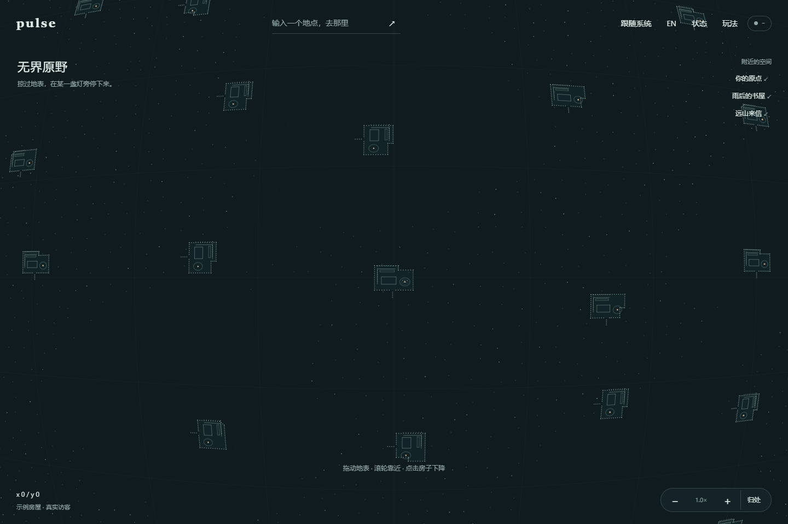
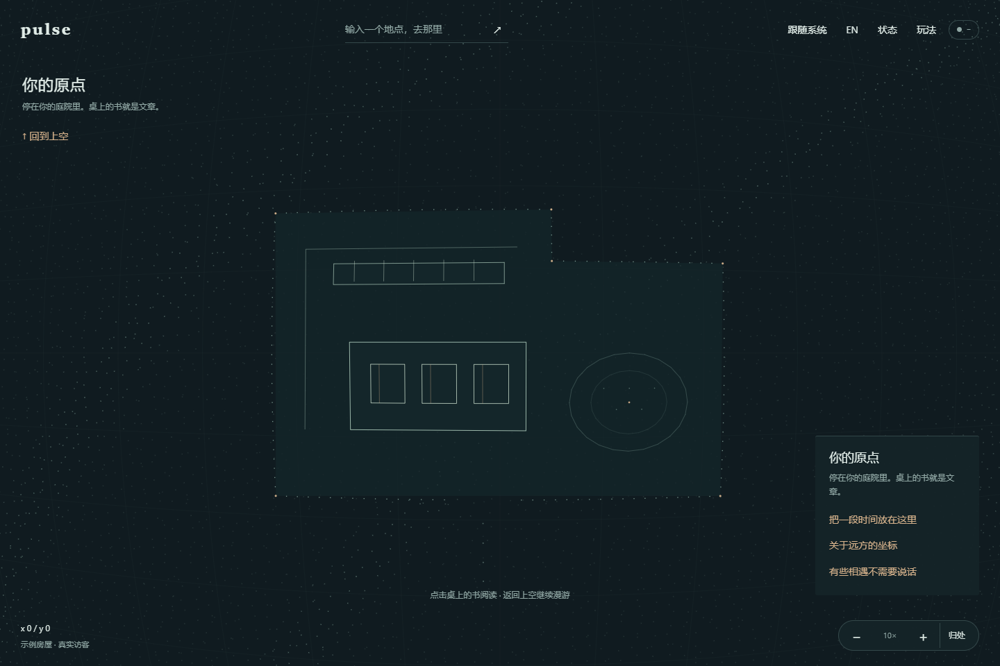

# PULSE 抽象个人空间与流畅度修订

> 后续视觉已由 [11 文章岛](11-publication-islands.md) 替代：用户不满意庭院，正式前端改用错落文章页。本文件保留缓存修复依据与上一轮造型历史；不要再同步旧庭院 Demo 覆盖正式前端。

更新：2026-09-08；修改前源码基线：`9c94b8d`。此次同时修改正式前端与独立 Demo，没有提交、推送或部署。

## 已确认的新方向

用户不喜欢传统房屋的线框盒子，最新选择是：**抽象个人空间，不强调传统房屋，用粒子边界围出书桌、书架和庭院。**

[09 世界体验方案](09-particle-world-experience.md) 中的曲面漫游、无可见星球边缘、连续下降、坐标探索继续保留；建筑表达改以本文为准。“屋顶淡去”现在由轻薄的上层点线淡去承担，不再做山墙屋顶、屋面点阵和箱体立柱。

## 这版具体表现

- 个人空间有三种稳定的边界轮廓，由空间自身数据选择，不随镜头移动随机改变。
- 粒子围合边界，底部留入口；局部薄隔断提示纵深。书架、桌面与庭院并置，留下呼吸空间。
- 高处能看见空间的大致安排；下降后书本更清楚，上层点线淡去。所有物件始终在原来的世界/局部坐标中。
- 庭院用环形边界和少量种子点表达，不添加拟真植物或装饰图标。家具与边界编辑仍是下一阶段目标。
- 正式页保留真实连接入口；单文件 Demo 的访客仍明确为模拟，不借这次视觉升级声称完成真实房屋存储。





另见 [明亮模式](design/particle-space-light.png) 和 [窄屏](design/particle-space-mobile.png)。以上截图来自本机静态前端预览，未接 WebSocket 服务。

## 卡顿的原因与修复

### 先修复看起来像“卡住”的正确性问题

旧 `drawTerrainCached` 在移动时把缓存键写成空字符串，进入移动态后每帧键都相同；实际条件也没有强制移动时重画。镜头和房屋在变，地表位图却沿用第一帧，停下才突然更新。

浏览器实际复现：90 个观察帧里相机位置变化，地表背景重绘为 **0 次**。修复后，同一连续飞行检查中为 **90 次**。因此，旧版移动时很低的耗时本身不是正确的性能成果。

### 再减少真正的绘制工作

1. **静态场景整体缓存：** 地表与个人空间共用一张离屏位图，真实访客和脉冲仍由实时层每帧绘制。键包含实际相机位置/尺度、窗口、调色板版本、选中空间与室内状态。静止观察窗内重绘从 1 次降为 0 次。
2. **避免反复分配画布：** 只有尺寸变化时重新设置离屏画布宽高；不再每 250ms 为地表微光重建整张位图。取消了很轻的地表呼吸，不影响真实指针或点击反馈。
3. **有界采样缓存：** 地形按 16×16 个点的区块缓存世界位置与颜色档，最多 192 块。移动时重新投影已采样的点，避免重复执行三角函数和散列。缓存淘汰不改变同一地点的生成结果。
4. **微粒走轻量绘制：** 按 12 档颜色/透明度复用样式，小点用 `fillRect`；省去每点 `beginPath/arc/fill`，也避免把大量子路径一次提交造成绘制开销。
5. **稳定细节预算：** 采样预算改为 8000，移动与静止使用同一规则；不再松手后突然切换密度。远处只显示空间轮廓，靠近才加入书本细节。
6. **停止不可见惯性尾巴：** 屏幕速度足够小时精确归零，让缓存真正命中。相机的新输入仍可以立即中断飞行。

另外修正了进入空间后标题仍留在“无界原野”、`hidden` 被布局样式覆盖以及窄屏重复提示等可见问题。

## 如何复测，而不是只相信状态抽屉

[缓存回归脚本](../work/measure-world.cjs) 直接运行正式 `world.js`，检查“镜头确实移动时地表也更新”和“静止时不定时重建”。[报告](../work/world-perf-after.json) 保留实际计数。

[固定轨迹性能对比](../work/profile-world.cjs) 在相同 1440×960、DPR 1、Edge 无头环境中，分别执行 100 个固定相机位置。旧源码 fixture 来自 `9c94b8d:static/world.js`，对照时只纠正其缓存冻结条件，使两边都真正绘制移动地表。

该次 [对比报告](../work/world-profile-comparison.json) 的原始绘制耗时：中位数 **5.6 → 2.1 ms**，P95 **6.9 → 3.4 ms**。观察到的 rAF 间隔中位数 **20.8 → 4.2 ms**，P95 **25 → 8.5 ms**。无头环境可能采用高刷新率调度，这些数值不应换算后宣传为用户设备的 FPS，也不是低端手机或线上多人性能保证。

已运行四个投影行为测试，以及 [实际前端浏览器检查](../work/check-space-ui.cjs)：缓存复用、指针锚定缩放、连续进入、Canvas 书本命中、DOM 阅读与返回、明暗/语言持久化、390px 布局。浏览器 [报告](../work/space-ui-validation.json) 没有脚本异常。独立 Demo 的完整交互检查也通过，记录在 [演示验证报告](../work/particle-demo-validation.json)。

JS 语法、Markdown 围栏与本地链接检查通过。设计检测发现原有状态抽屉进度条使用 `transition: width`，该样式位于隐藏的诊断区，本次没有改动它。

本轮没有修改 Go 或 WebSocket 协议，没有重新执行真实多人集成或生产验证。尚需真实设备确认触摸手感、长时间内存和多人数量增加后的帧率；当前不能声称用户的全部卡顿来源都已排除。

## 给 KIMI 的继续执行说明

```text
最新偏好以 docs/10-abstract-space-and-performance.md 为准。
用户已经选择抽象个人空间：粒子边界、书桌、书架、庭院；不要再画传统盒子屋顶。
保留 docs/09 的巨大曲面漫游与连续下降，下降时淡去上层点线。

正式实现位于 static/world.js，独立展示位于 outputs/pulse-particle-world-demo.html。
不要把示例空间当真实作者存储，也不要重新开发已接线的 v2 实时协议。
先看当前 diff，不覆盖其他 agent 的修改。

缓存必须包含相机实际坐标；移动时不能一直复用空字符串键。
先确认画面正确，再比较绘制时间；不要靠冻结地表换取低耗时。
真实指针与脉冲保持每帧更新，主题与选择变化必须让场景缓存失效。
新物件、书本拖拽和空间编辑落地时，也必须纳入场景版本/缓存失效契约。

下一次视觉评价只问“空间的边界、庭院和家具关系是否舒服”。
用户尚未确认细节样式，不要称这版为最终设计。
每个函数与业务回调继续写中文契约注释。不要自动推送或部署。
```

需要同步独立 Demo 时运行 `python work/sync-space-demo.py`。它复制正式绘制段落，保留离线 Demo 的偏好、阅读与模拟访客装配；仍需运行演示浏览器检查，不能只凭同步脚本退出成功验收。
