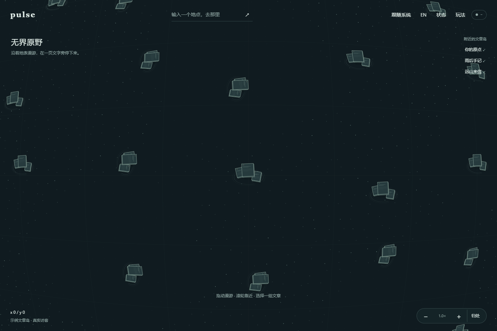
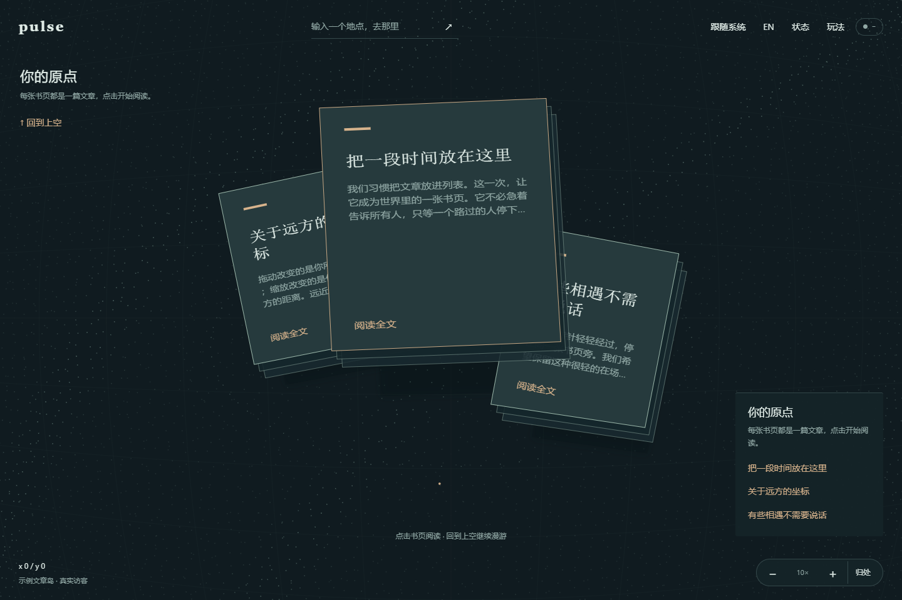

# PULSE 文章岛：用内容建立空间

> 2026-09-08 后续：正式前端仍是本文实现，但用户反馈纵深和美观不足。[12 历史实验](12-floating-isles-stele-forest.md) 也已被否定；最新复盘及建议见 [13 粒子纵深](13-particle-depth-direction.md)。本文保留实现记录，不代表用户已认可视觉效果。

2026-09-08。本轮直接修改正式 `static/`，保留已有未提交改动，不生成或同步新 Demo。

## 为什么换掉房子

用户再次反馈抽象庭院仍不理想，希望尝试其他博客载体，或让空间有更明确的层次。此次选择文章岛：一组错落书页对应一个人的文章空间，书页本身就是文章。这样探索最终指向内容，减少“先进入建筑，再找文章”的理解步骤。

这一视觉决定替代 [10 的庭院方案](10-abstract-space-and-performance.md)。巨大曲面、拖动探索、连续靠近、明暗、双语和实时指针继续保留。旧单文件 Demo 是上一轮快照，不再作为本轮视觉验收对象。

## 层次如何成立

- 下层是地表与两条淡粒子弧线，表明文章属于同一个集合，没有封闭地板或围墙。
- 三张文章页各有位置、旋转与高度。落影停在地表，纸页抬高；前后遮挡和薄纸侧边建立层次。
- 置顶文章位于最前层，其他两篇错落在两侧。远处仅画轻量排版线，靠近后显示已有示例文章的真实标题和摘要。
- 完整正文仍由 DOM 阅读页呈现，支持文字选择与滚动。页面旁保留键盘可用的文章入口，窄屏不强迫用户在微小画布文字上阅读。

另见 [明亮模式](design/publication-island-light.png) 和 [窄屏](design/publication-island-mobile.png)。截图来自实际静态前端预览，不代表生产部署或多人验证。

## 代码入口与边界

`static/world.js` 的 `PUBLICATION_PAGES` 定义当前三篇示例文章的局部布局；`pagePoint/pageCorners` 统一投影，`drawHouse` 沿用旧空间 API 名称以保持接线兼容，视觉上已不绘制建筑。

`drawPageText` 使用 `setPublicationText` 注入的当前语言标题和摘要。内容来自 `static/articles.js` 的双语 fixture，不读取或伪造真实作者文章；切语言会让场景缓存失效。纸面色、叠页色和投影色由 `static/tokens.css` 定义，继续分别适配明暗。

纸张命中改为四边形检测，按绘制顺序反向查询，顶层文章优先。不能继续用一个大圆圈代替每张书页的命中区域，否则后层露出的内容容易被前层误选。

沿用有界地表采样和静态场景缓存。远景不排正文、不使用模糊落影；近景才显示预览文字和轻落影。真实访客与脉冲仍独立每帧绘制。尚未连接时保留系统光标，收到真实本地身份后再使用实时箭头，断线时恢复系统光标。

作者身份、真实文章持久化、用户自定义排列与收藏行为仍需接入。这次改变视觉载体，不声称完成文章管理系统；既有墙/门/家具编辑愿景应在用户确认新方向后重新评估优先级。

## 本轮验证

复用并更新 [实际页面交互检查](../work/check-space-ui.cjs)：静止缓存、缩放锚点、连续靠近、三张书页各自点击、DOM 阅读/返回、主题与语言持久化、390px 布局。结果见 [页面报告](../work/publication-ui-validation.json)。

沿用 [渲染缓存回归](../work/measure-world.cjs)，检查静止时不定时重绘、移动时地表跟随实际镜头；本轮报告见 [渲染报告](../work/publication-render-validation.json)。旧性能对比数据只代表上一轮，不用它声称新造型在所有设备上都达到固定帧率。

没有修改 Go 或消息字段，没有进行真实多人、真实手机触摸或生产环境验证；未提交、推送、部署。用户对这版外形的满意程度仍待实际使用反馈，不能由代码完成推定。
